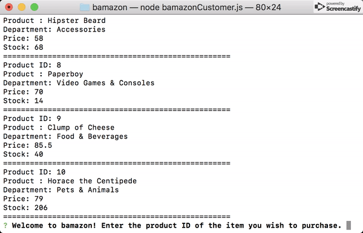
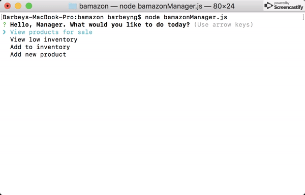
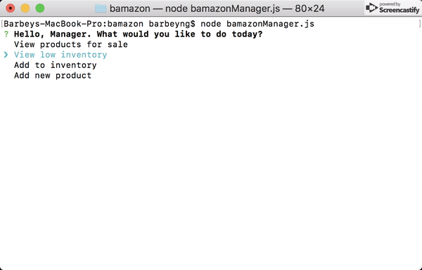

# Welcome to :boom: bamazon :boom:

## What is the purpose of this app?
The purpose of this application is to utilize both node.js and MySQL as well as the inquirer package to mimic an online retailer in the command line.

## How to use this app
You can choose to run the app as a customer. Just navigate through the prompts to complete your purchase.

You can also opt to run the program as a manager. As a manager you have options.

You can view all products or items with low inventory.

Add inventory.

Or add a new product.

